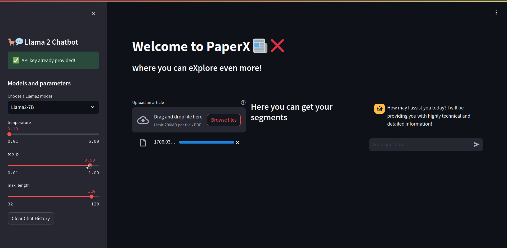
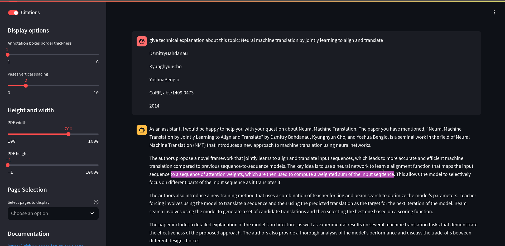
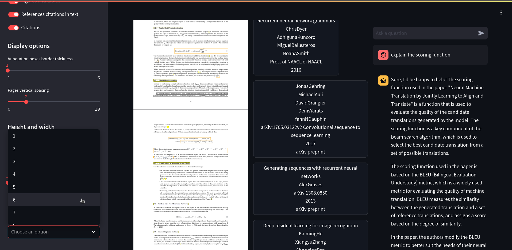
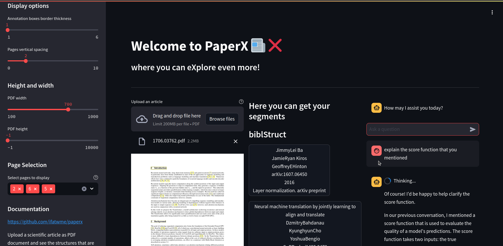

# paperx
Feed papers to get your desired results by few clicks!

## Introduction
Using llama and grobid tools, I have built an application where understanding papers and processing it would be easier, while keeping your privacy safe :)!

the chatbot is provided by replicate api.

<table>
    <tr>
        <td align="center"></td>
        <td align="center"></td>
    </tr>
    <tr>
        <td align="center"></td>
        <td align="center"></td>
    </tr>
</table>

## Getting started
you got two option in order to deploy and use this app

### install requirements and setup python env
- First of all set up a python environment (or just run it on your base python env):
	1. install venv to create virtual python environment:
```shell
python3 -m pip install venv
```
- Now let's install all the requirements in order to get started with the project.
```shell
pip install -r requirements
```

### bring up the grobid editor
- now using **docker** we will bring up the grobid server in a container:
```shell
docker run -d --rm --init --ulimit core=0 -p 8070:8070 lfoppiano/grobid:0.8.0
```

### llama the language model
- Downlaod the models from the source (huggingface) using the **download_model.sh** script, this will take the url from the **.env_model** and then download the llm model accordingly, you can skip downlaoding the remaining models by removing their url from that file. this script will save the models in **./models** directory.
```shell
./download_model.sh
```

- now bring up the container that has the llama model as a server, the model i choose is **llama-2-7b-chat.Q4_K_M.gguf**:
```shell
docker run -p 8080:8080 -v ./models:/models ghcr.io/ggerganov/llama.cpp:server -m models/llama-2-7b-chat.Q4_K_M.gguf -c 512 --host 0.0.0.0 --port 8080
```
- or another option is to use an api key from **https://replicate.com** an put is in the .env file.(that's what i did)

### streamlit app
- you can run the app directly on your machine using the below command on port 8051.
```shell
streamlit run streamlit_app.py
```


## resources
- structure-vision: https://github.com/lfoppiano/structure-vision
- grobid: https://github.com/kermitt2/grobid
- grobid_client_python: https://github.com/kermitt2/grobid_client_python
- How to build a Llama 2 chatbot: https://blog.streamlit.io/how-to-build-a-llama-2-chatbot/
- streamlit-pdf-viewer: https://github.com/lfoppiano/streamlit-pdf-viewer
- models source: https://huggingface.co/TheBloke/Llama-2-7B-Chat-GGUF
- llama + streamlit blog post: https://medium.com/@odhitom09/running-openais-server-locally-with-llama-cpp-5f29e0d955b7
